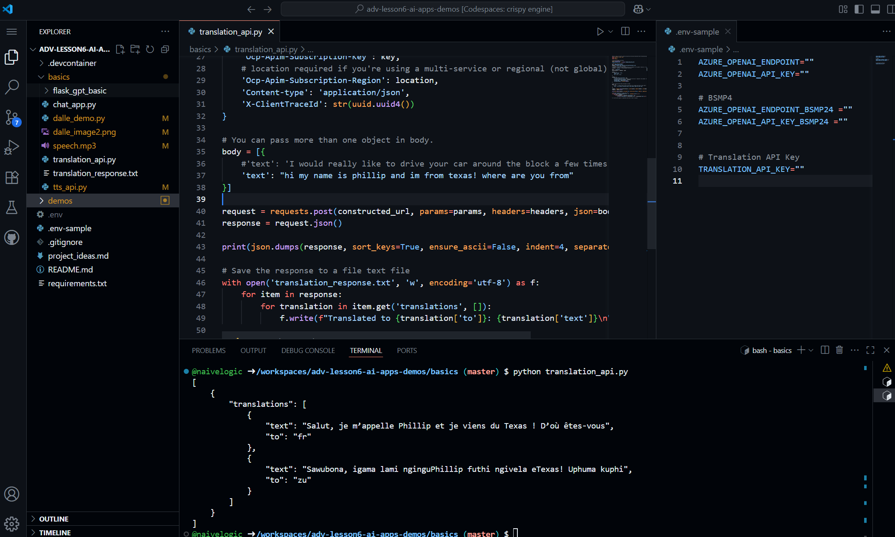

# Lesson 6: Building AI Apps with Azure OpenAI & Flask

Welcome to Lesson 6! Today you'll get hands-on experience running and building AI-powered web apps using Azure OpenAI (AOAI) and Flask. We'll start with the basics, explore demos, and then work on your own project ideas.

---

## Part 1: Run Through the Basics

Navigate to the `basics/` folder. We'll run and discuss each app:

### 1. `chat_app.py`
- **How to run:**
  ```bash
  cd basics
  python3 chat_app.py
  ```
- **What it does:** Simple Flask web app with a form to send prompts to AOAI (LLM). The LLM (GPT) responds to your input.
- **Components:**
  - **Flask:** Handles web requests and serves the form.
  - **LLM (GPT):** Processes user input and generates responses.

### 2. `flask_gpt_basic/app.py`
- **How to run:**
  ```bash
  cd basics/flask_gpt_basic
  python3 app.py
  ```
- **What it does:** A more advanced Flask app with chat features and templates. Interacts with AOAI for chat completions.
- **Components:**
  - **Flask:** Manages routes, templates, and user sessions.
  - **LLM (GPT):** Provides chat responses.

> 


### 3. `dalle_demo.py`
- **How to run:**
  ```bash
  cd basics
  python3 dalle_demo.py
  ```
- **What it does:** Uses AOAI's DALL-E to generate an image from a prompt and saves it locally.
- **Components:**
  - **Python script:** Sends prompt to DALL-E, downloads and saves the image.

### 4. `tts_api.py`
- **How to run:**
  ```bash
  cd basics
  python3 tts_api.py
  ```
- **What it does:** Uses AOAI's Text-to-Speech API to generate speech from text and saves it as an MP3.
- **Components:**
  - **Python script:** Sends text to AOAI TTS, downloads and saves the audio file.

### 5. `translation_api.py`

**Overview:**  
This script demonstrates how to use Azure's Translator service via its REST API to translate text between languages.

**How to run:**
```bash
cd basics
python3 translation_api.py
```

**How it works:**  
- Prompts you to enter the text you want to translate and the target language code (e.g., `fr` for French, `es` for Spanish).
- You must update the following line in the script to input your own text for translation:
  ```python
  body = [{
      # 'text': 'I would really like to drive your car around the block a few times!'
      'text': "hi my name is phillip and im from texas! where are you from"
  }]
  ```
  Replace the value of `'text'` with your own sentence.
- Calls the Translator REST API with your input.
- Displays the translated text in the terminal.

**Example:**  
  
*Enter your prompt in the terminal when asked.*

**To call the Translator service via the REST API, you need to include:**
- Your Azure subscription key and endpoint URL.
- The text to translate and the target language code in the request body.
- Proper headers for authentication and content type.

See the script for details on how these are set up.
---

## Part 2: Explore the Demos

Check out the `demos/` folder. There are many cool AI app examples (games, chatbots, productivity tools, etc.).

**Instructions:**
1. Pick **two demos** to run and explore. Try to understand how they work and what AI features they use.
2. For **one demo**, work with Copilot in agent mode to add a new feature. Example prompts:
   - "Add a leaderboard to the flappybird game."
   - "Make the chess app announce the winner with text-to-speech."
   - "Add a dark mode toggle to the playlist app."
   - "Let users upload their own images in the DALL-E demo."
3. Share screenshots of your work in the Teams chat!

---

## Part 3: Build Your Own AI Web App

For the rest of class, start building your own web app with an AI component. You can use the demos or previous projects as a starting point.

### AI for Good Project Ideas
See `project_ideas.md` for inspiration! Some examples:
- AI tutor for step-by-step math help
- Mental health chatbot
- AI app to track and reduce carbon footprint
- Financial literacy coach for teens
- Accessibility tools (sign-to-text, reminders)


> demos/autocomplete

<video controls width="600">
    <source src="https://nfl24cdn.azureedge.net/nflblob/bsmp25/lesson6/autocomplete.mp4" type="video/mp4">
</video>


> demos/chess_ai_app
>
> 


> demos/flappybird
> 
> 

> demos/studyguideapp
> 

<video controls width="600">
    <source src="https://nfl24cdn.azureedge.net/nflblob/bsmp25/lesson6/studyguideapp.mp4" type="video/mp4">
</video>


**Example Copilot prompts to get started:**
- "Create a Flask app that helps users track their study time and gives motivational messages using GPT."
- "Build a web app that analyzes uploaded images for signs of pollution."
- "Add a scholarship finder feature to my college app using AOAI."
- "Make a chatbot that gives budgeting tips to teens."

Share your progress and ideas in Teams. Have fun and be creative!

---

## Need Help?
- Ask Copilot in agent mode for step-by-step help.
- Reach out to your instructor or classmates.

Let's build something awesome!
